<p align="center">
  
</p>

<p align="center">
  
  
  
  
  <a href="LICENSE"></a>
</p>

**YieldVisor** is a Django web application for tracking investments across **stocks**, **cryptocurrencies**, and **Steam market items**. It combines portfolio management, live prices, historical charts, analytics, and price alerts in one dashboard.

The public website is available at **https://yieldvisor.bibikau.org**.

Market prices and item history are provided by a separate API at **https://api.bibikau.org**. API used for gathering prices and history [InvestAPI](https://github.com/Max2772/InvestAPI).

## Screenshots

### Landing Page

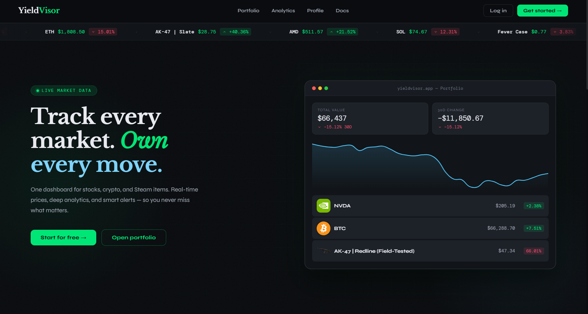
---

### Portfolio

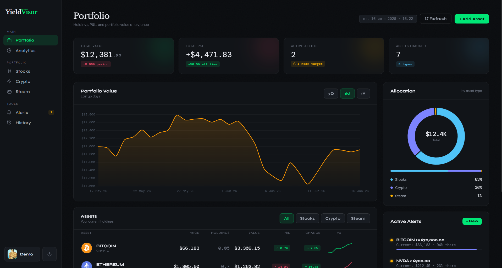
---

### Analytics

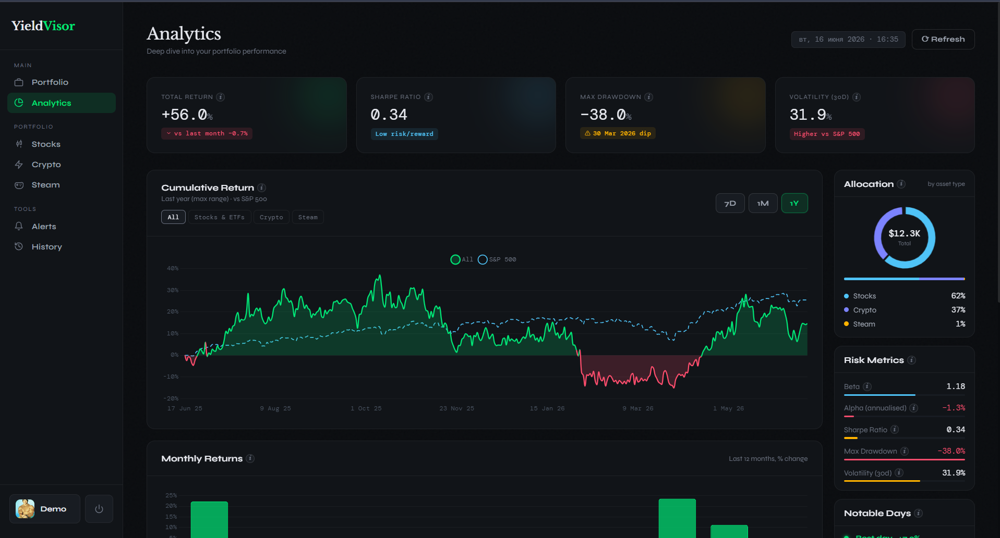
---

### History

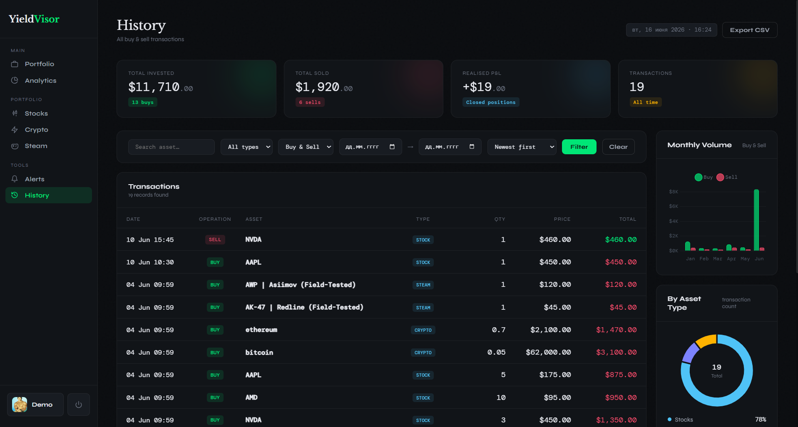
---

### Stocks

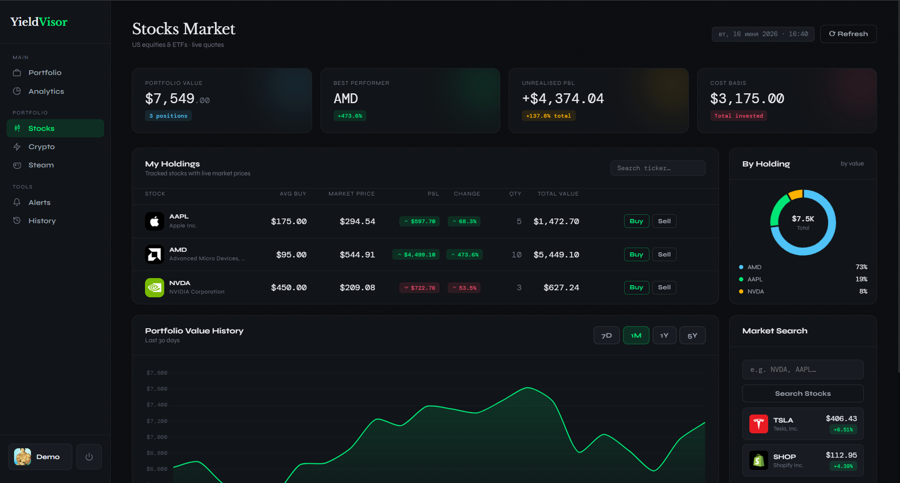
---

### Stock Details

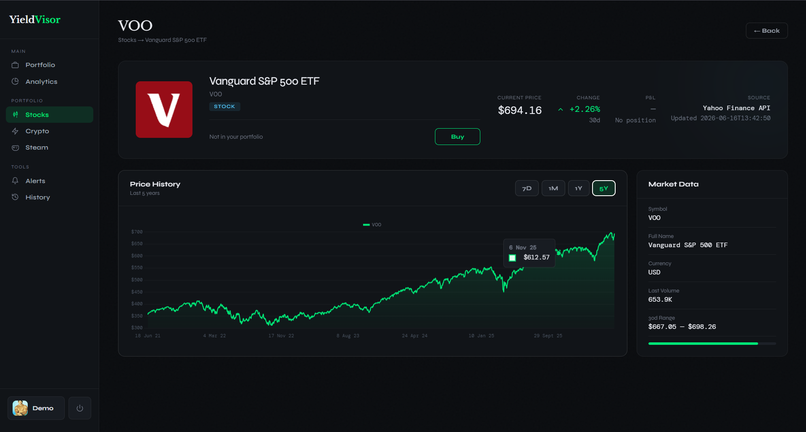
---

### Crypto

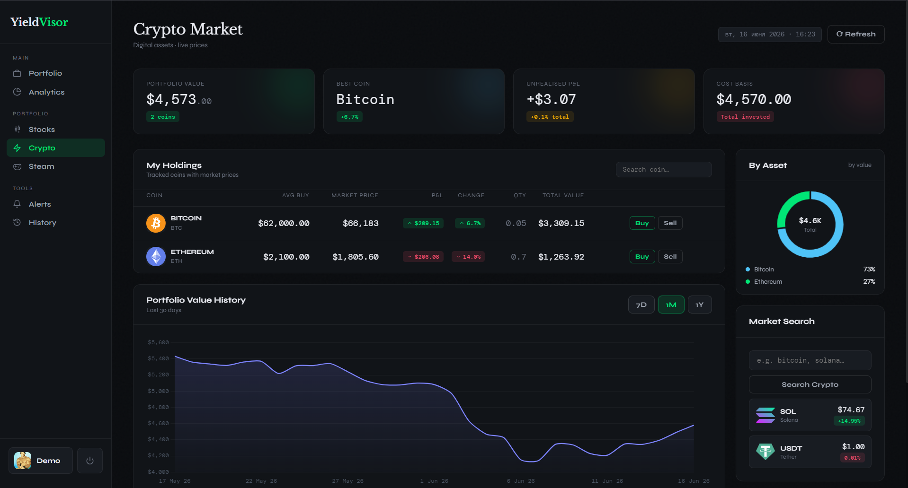
---

### Crypto Details

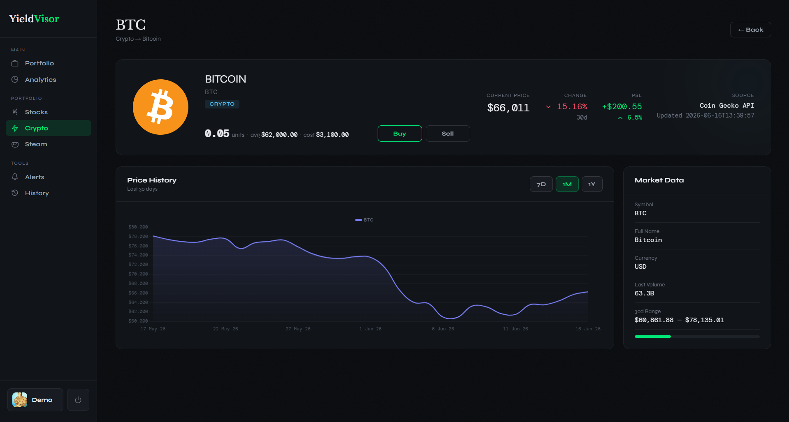
---

### Steam Market

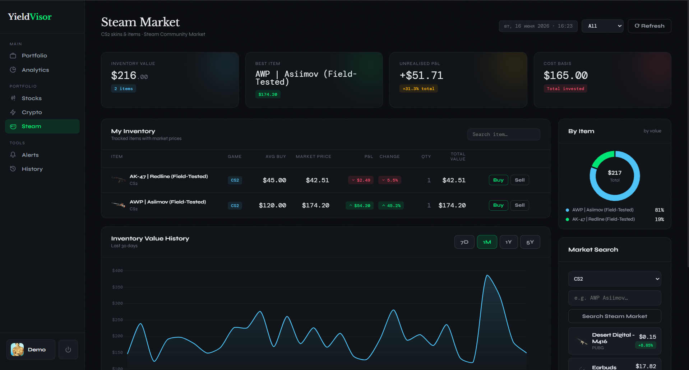
---

### Steam Item Details

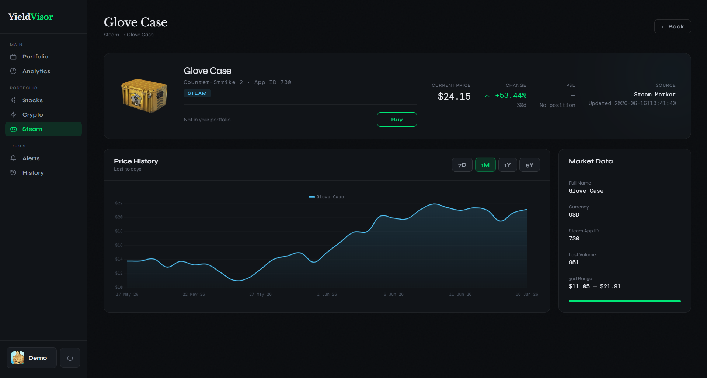
---

### Alerts

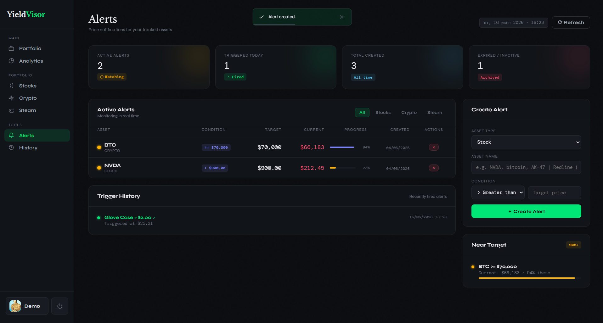
---

## Features

- Portfolio tracking for stocks, crypto assets, and Steam items.
- Live market prices from the external YieldVisor API.
- Historical price charts and portfolio value history.
- Analytics for allocation, profit and loss, returns, and risk metrics.
- Price alerts with greater-than and less-than conditions.
- User accounts with email/password login and OAuth support.
- Simple web interface built with Django templates, CSS, and JavaScript.

## Tech Stack

- Python 3.11+
- Django
- SQLite for local development
- Redis cache in production
- django-allauth for OAuth login
- httpx for API communication
- Chart.js for charts

## Local Setup

1. Clone the repository:

```bash
git clone https://github.com/Max2772/YieldVisor.git
cd YieldVisor
```

2. Install dependencies with `uv`:

```bash
uv sync
```

If you prefer the classic `requirements.txt` workflow, use this instead:

```bash
python -m venv .venv
.venv\Scripts\activate
pip install -r requirements.txt
```

When using the second setup, run the Django commands below as `python manage.py ...` instead of `uv run python manage.py ...`.

3. Create a `.env` file in the project root:

```env
MODE=DEV
SECRET_KEY=your-secret-key
ALLOWED_HOSTS=127.0.0.1,localhost
CSRF_TRUSTED_ORIGINS=http://localhost,http://127.0.0.1
INVEST_API_BASE_URL=https://api.bibikau.org

##################### Optional #####################
INVEST_API_TIMEOUT=15
INVEST_API_CACHE_TTL=300

SITE_ID=1
SITE_DOMAIN=example.com
GOOGLE_OAUTH_CLIENT_ID=
GOOGLE_OAUTH_CLIENT_SECRET=
GITHUB_OAUTH_CLIENT_ID=
GITHUB_OAUTH_CLIENT_SECRET=

TURNSTILE_SITE_KEY=
TURNSTILE_SECRET_KEY=
```

4. Apply migrations:

```bash
uv run python manage.py migrate
```

5. Load demo data:

```bash
uv run python manage.py load_test_data
```

This creates sample users, portfolios, history rows, and alerts. The default users are `demo`, `alice`, and `bob`; the password for all of them is `testpass123`.

To reload the sample data from scratch, run:

```bash
uv run python manage.py load_test_data --clear
```

You can also set a custom password:

```bash
uv run python manage.py load_test_data --password your-password
```

6. Run the development server:

```bash
uv run python manage.py runserver
```

The local app will be available at **http://127.0.0.1:8000**.

## Project Structure

```text
apps/
  analytics/   Portfolio metrics and charts
  alerts/      Price alert logic
  core/        Shared market API services
  crypto/      Cryptocurrency pages
  history/     Price and portfolio history
  main/        Landing page
  portfolio/   User portfolio management
  steam/       Steam market item pages
  stocks/      Stock market pages
  users/       Authentication and profiles
config/        Django project settings and URLs
static/        CSS, JavaScript, icons, and favicon files
templates/     Shared Django templates
```

## Disclaimer

This project was created as coursework for the Object-Oriented Programming course. The application is intended for educational and portfolio-tracking purposes, not as financial advice.
